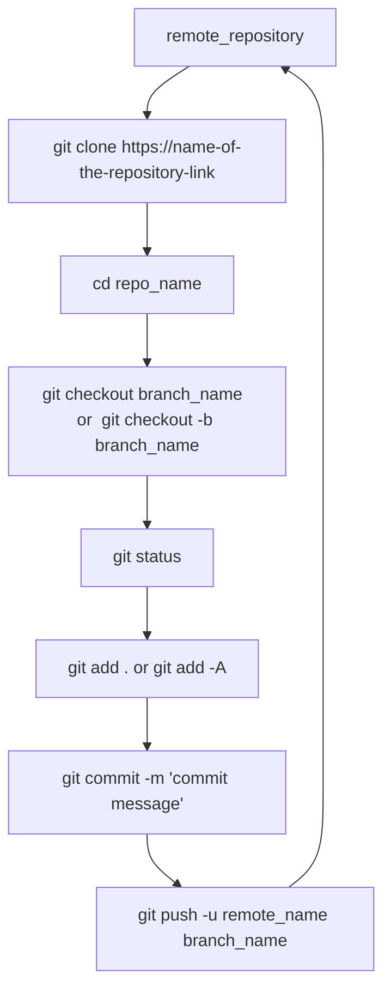

# Git Workflow for Developers:

we will Learn the Git Commands below that are needed for daily programming as part of development.

**1. Git    clone:** 
Git clone   command is  used    to  pulls  down    a   full    copy    of  all the repository  data    that    GitHub  has at  that    point   in  time,   including   all versions    of  every   file    and folder  for the project,    In  other   words,  Git clone   basically   makes   an  identical   copy    of  the latest  version of  a   project in  a   repository  and saves   it  to  our local   computer(VDI). 

We  can clone the repository  with  the following   commands.  

`git clone https://name-of-the-repository-link` 
or 
`git clone git@github.com: name-of-the-repository-link` 

For example,    if  we  want    to  download    a   project from    GitHub, all we  need    to  select  the repository  which   we want    to  clone   and then    click   on  the green   button  (clone  or  download),  copy    the URL in  the box and paste   it  after   the git clone   command. 

git clone   will    make    a   copy    of  the project to  local workspace, so  we  can start   working with    it. 

**2. Git    branch:** 
Branches    are highly  important   in  the git world. isolating    development work    without affecting   other   branches    in  the repository, means   several  developers  will    be  able    to  work    in  parallel    on  the same    project simultaneously by  using   branches. We  can use the git branch  commands    for creating,   listing,    and deleting    branches. 

*Creating  a   new branch:* 

We  can create  a   new branch  from    GitHub  and as  well    as  from   Git bash    locally. 

To  create  a   new branch  in  GitHub, navigate    to  the main    page    of  the repository.  in the  branch  menu   choose the  source  branch  and create  a   branch. 

For example,    if  we  want to write   a   code    as  per user    stories,    create  a   ‘feature branch’    from    the ‘main/master’ or    'developer' branch  which   has latest  version of  code. 

To  create  a   new branch  in  local   using   Git terminal,   first   we  have    to  clone   the remote  repository  from    the GitHub  using   git clone   command,    then    create  a   new branch  with    following   command. 

`git branch <branch_name>` 

Above   command will    create  a   new branch  in  local. 

To  push    the changes of  new branch  to    the   remote  repository  in  GitHub, we  need    to  use the following   command. 

`git push -u <remote_name> <branch_name>` 

**Note:**   Before  push   we  need    to  checkout    the  feature branch  and add and commit  the changes then    Push    changes to  remote  repository. 

*Viewing branches:* 

`git branch -a` or `git branch –list` 

*Deleting a branch:* 

`git branch -d <branch_name>` 

**3. Git    checkout:** 
The git checkout    command lets    navigate    between the branches    created by  git branch. Checking    out a   branch  updates the files   in  the working directory   to  match   the version stored  in  that    branch, and it  tells   Git to  record  all new commits on  that    branch. and we can  checkout    to  branch  with    the following   command. 

`git checkout <branch_name>` 

We  should  follow  some    steps   to  switching   between branches: 

1.  The changes in  current branch  must    be  committed   before  switch. 
2.  The branch that we  want    to  check   out should  exist   in  our local. 

Thers   is  a   shortcut    command that    allows  us  to  create  and switch  to  a   branch  at  the same    time: 

`git checkout -b <branch_name>` 

The above   command creates a   new branch  in  local   (-b stands  for branch) and checks  the branch  out to  new right   after   it  has been    created. 

**4. Git    status:** 
The git status  command is  used    to  show    the status  of  the git repository. This    command displays    the state   of  the local   directory   and the staging area,   we can view status with the following   command. 

`git status` 

**We    can view    the    information    like:** 

1.  Whether the current branch  is  up  to  date 
2.  Whether there   is  anything    to  commit, push    or  pull. 
3.  Whether there   are files   staged, unstaged    or  untracked. 
4.  Whether there   are files   created,    modified,   or  deleted. 

**5. Git    add:** 
The git add command adds    changes in  the working directory   to  the staging area.   It  tells   Git that    we  need    to  include updates to  a   particular  file    in  the next    commit. However,    git add doesn't really  affect  the repository. we  can update  changes with    the following   commands. 

To  add a   single  file: 

`git add <file_name>` 

To  add all files   at  a   time: 

`git add .` or `git add -A` 

**Note:** The   git add command doesn't change  the repository  and the changes are not saved   until   we  use git commit. 

**6. Git    commit:** 
The git commit  command captures    a   snapshot    of  the project's   currently   staged  changes.    means   used    to  save    changes to  the local   repository. 

Git commit  is  like    setting a   checkpoint  in  the development process which   we can  go  back    to  later   if  needed. 

We  also    need    to  write   a   short   message to  explain what    we  have    developed   or  changed in  the source  code.   we can commit   the changes with    the following   command 

`git commit -m <"commit_message">` 

**7. Git    push:** 
The git push    command is  used    to  upload  local   repository  content to  a   remote  repository. when changes    are commited    we  need    to  push    these   changes to  remote  repository. we  can push    the changes with    the following   command. 

`git push -u <remote_name> <branch_name>` 

If  the branch  is  created newly in local  repository,  then    we  also    need    to  push    that branch  with   the following   command: 

`git push -u origin <branch_name>` 

**Note:** Git   push    only    uploads changes which   are committed. 

**8. Git pull:** 
 The    git pull    command is  used    to  get updates from    remote  repository. it  is  combination of  git fetch + git merge,  when    do  git pull    it  fetch   and download    content from    a   remote  repository  and immediately update  the local   repository  to  match   that    content.    we  can pull    updates with    the following   command. 

`git pull remote` 

**9. Git    revert:** 
The git revert  command is  a   forward-moving  undo    operation   that    offers  a   safe    method  of  undoing changes.    Sometimes   we  need    to  undo    the changes that    we  have    made,   There   are various ways    to  undo    our changes locally or  remotely,   but we  must    carefully   use these   commands    to  avoid   unwanted    changes/deletions. 

A   safer   way that    we  can undo    our commits     by  using   git revert. To  see our commit  history,   we   can see logs    with    the following   command. 

`git log –oneline` 

After   that    we  just    need    to  specify the hash    code    next    to  our commit  that    we  would   like    to  undo: 

`git revert <commit_Id>` 

The Git revert  command will    undo    the given   commit  but will    create  a   new commit  without deleting    the older   commit. 

The advantage   of  using   git revert  is  that    it  doesn't touch   the commit  history.    it  means   that we can still   view all the commit history,    even    the reverted    commits. 

Another safety  measure here    is  that    everything  happens in  our local computer  unless  we  push    them    to  the remote repository.  That's  why git revert  is  safer   to  use and is  the preferred   way to  undo    the commits. 

**Steps to  Clone   the Project Code    and Push    to  Remote  Repository  in GitHub  Using   Git Bash Terminal:** 

1.  Clone repository  from    GitHub  to  local   computer(VDI).  from    repository  page    on  GitHub  click   the green   button  labeled clone   or  download    and "clone  with    HTTPS'  section and copy    the repository **url**. 

2.  Open  up  a   git bash    terminal  in  local   computer(VDI)   and navigate    to  the directory   where   we  want    to  clone   the repository  and run the git clone   command with the    address of  respository with  the following   command. 

    `git clone https://name-of-the-repository-link` 

3.  Next  use CD  to  change  the directory   to repository folder    which is    cloned. 

    'cd <repo_name>' 

4.  By  default we will be  on  'main/master'   so  we  need to create  a   new branch    ('feature  branch': this    colud be  created in  remote  repository  or  could be  created in  terminal    based on process)   and checkout    to  that    branch  where   we    want    to  write   the code    as  per the tasks.  we can  checkout    with    the following   commands. 

    `git checkout <branch_name>` 
     or 
    `git checkout -b <branch_name>` 

5.  Next  open    up  code    editor  like    VS  code    and writ    code    and test    it, and save    the changes,    once    we  are ok  with    the changes which   are saved,  then    go back to  terminal    and run the following   commands. 

    `git status`    // To    keep    track   of  this    change. 
    `git add . `   // To add the all changes. 
    `git commit -m "commit message”`   //To commit all changes. 

6.  So    far   we  have    only    modified    our local   copy    of  the respository.    To  add the changes to  git repo    files   on  local   computer    to  the version of  remote  repository  on  GitHub  we  can push    chnages with  the following   command. 

    `git push -u <remote_name> <branch_name>` 

    **Note:**   we  need    to  provide GitHub  username    and password,   if any message pop-up for  authorization. 

7.  After we  have    pushed  commits,    visit   the remote  repository  on  GitHub  and notice  that    changes are reflected   there,  then    we  need    to  create  a   pull    request form    “feature branch to  “main/master branch”    by  adding required Reviewers . 

8.  Reviewers will    review    PR's    and merge   the changes by  approving   the PR's.   If  reviewers   identified any code issue   or  conflicts,  that    PR  will    be  reject  and Developers  need to be  work    on  code    fix accordingly. 

9.  Reverting commits: Sometimes    we  have    to  undo    commits based   on  modification    or  issues  in  code,   so  we must revert  the commits to  previous    version,    and to  revert,   we  need    to  run the git log –oneline in the git terminal    and find    the latest  commit, then run the git revert command with the    following   commands.   then    we  need to  push    the latest  commit  to  the remote  repository  by  creating PR. 

    `git log –oneline` 

    `git revert <commit_Id>` 

----
 

*****

**Steps   to  Clone   the Project Code    and Push    to  Remote  Repository  in  GitHub   Using VS Code:** 

1.  Open  up  VS  code    local   computier(VDI)  and navigate    to  source  control top left    side. 

2.  Next  click   on  clone   repository  and then    click   on  clone   from    GitHub, we  need    to authorize    the Visual  Studio  Code    with    GitHub  by  giving  Credentials (User   name    and password),  then we can view the    project code which  is  cloned. 

3.  Next  create  a   new branch  called  ‘feature branch’    to  add the new code into   that    branch  as  per user    stories. 

4.  To    create  a   new branch  from    the source  branch  ('main/master'  or  'develop')  which   has latest  code, click on checkout section at bottom   left    side    and create  a   new branch  or  checkout    branch  as  needed. 

5.  After changes have    been    done    and tested, we  need    to  commit  the changes,    for that    navigate    to  source  control and click   on  “commit”    by  giving  the commit  messages. 

6.  Next  we  need to push    commited    changes to  remote  repository, for that    navigate    to  source  control and click   on  Push. 

7.  Once the changes are pushed to feature branch in remote repository, we need to create a pull request form “feature branch” to “main/master branch” by adding required approvalsAfter we  have    pushed  commits,    visit   the remote  repository  on  GitHub  and notice  that    changes are reflected   there,  then    we  need    to  create  a   pull    request form    “feature branch to  “main/master branch”    by  adding required Reviewers. 

8.  Reviewers will    review    PR's    and merge   the changes by  approving   PR's.   If  reviewers   identified any code issue   or  conflicts,  that    PR  will    be  reject  and Developers  need to be  work    on  code    fix accordingly. 

9.  Reverting Changes:    to  undo    commits,    navigate    to  source  control select  commit  and click   on  Undo    last    commit. then    we  need    to  push    the latest  commit  to  the remote  repository  by  creating PR. 

---
#   Flow Chart:

 

